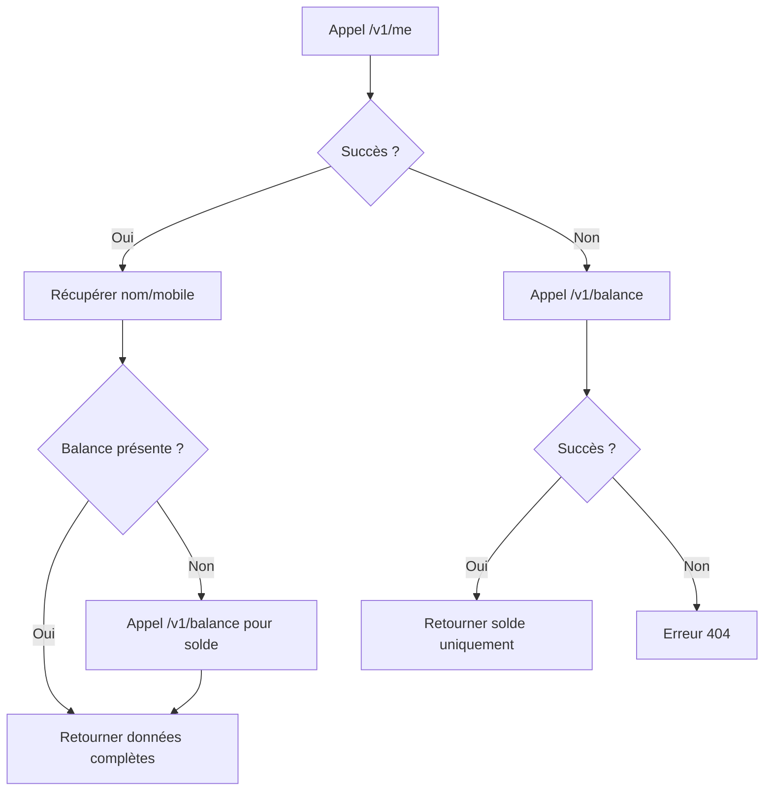

# 🔧 Correction API Wave Balance

## 🚨 Problème Identifié

L'API Wave balance ne retourne que 2 champs :
```json
{
    "amount": "198",
    "currency": "XOF"
}
```

Mais notre code attendait :
```json
{
    "balance": "198",
    "currency": "XOF", 
    "account_name": "Nom du compte",
    "account_mobile": "+221761234567"
}
```

## 🔧 Corrections Apportées

### 1. **API Balance Corrigée** (`/api/wave/balance`)

#### Stratégie Multi-Endpoint
```typescript
// 1. Essayer d'abord /v1/me pour les infos du compte
let waveResponse = await fetch('https://api.wave.com/v1/me')

if (waveResponse.ok) {
  // Récupérer nom et téléphone si disponibles
  const waveData = await waveResponse.json()
  account_name = waveData.name || waveData.account_name || null
  account_mobile = waveData.mobile || waveData.phone || null
  
  // Si pas de balance, essayer /v1/balance
  if (!waveData.balance && !waveData.amount) {
    const balanceResponse = await fetch('https://api.wave.com/v1/balance')
    // Combiner les données
  }
} else {
  // Fallback vers /v1/balance uniquement
  waveResponse = await fetch('https://api.wave.com/v1/balance')
}
```

#### Réponse Normalisée
```typescript
return NextResponse.json({
  balance: waveData.balance || waveData.amount, // Flexible
  currency: waveData.currency,
  account_name: account_name, // Peut être null
  account_mobile: account_mobile // Peut être null
})
```

### 2. **Interface TypeScript Mise à Jour**

```typescript
// ❌ Avant
interface WaveBalance {
  balance: string
  currency: string
  account_name: string
  account_mobile: string
}

// ✅ Après
interface WaveBalance {
  balance: string
  currency: string
  account_name: string | null
  account_mobile: string | null
}
```

### 3. **Affichage Conditionnel Amélioré**

```tsx
// ✅ Affichage intelligent
{(balance.account_name || balance.account_mobile) ? (
  <div className="text-sm text-muted-foreground mt-1">
    {balance.account_name && balance.account_mobile 
      ? `${balance.account_name} • ${balance.account_mobile}`
      : balance.account_name || balance.account_mobile
    }
  </div>
) : (
  <div className="text-xs text-muted-foreground mt-1">
    Solde Wave • {balance.currency}
  </div>
)}
```

## 🎯 Résultat

### ✅ **Cas 1 : API /v1/me Réussie**
```json
{
  "balance": "198",
  "currency": "XOF",
  "account_name": "John Doe",
  "account_mobile": "+221761234567"
}
```
**Affichage :** `198 XOF` + `John Doe • +221761234567`

### ✅ **Cas 2 : Seulement /v1/balance**
```json
{
  "balance": "198", 
  "currency": "XOF",
  "account_name": null,
  "account_mobile": null
}
```
**Affichage :** `198 XOF` + `Solde Wave • XOF`

### ✅ **Cas 3 : Infos Partielles**
```json
{
  "balance": "198",
  "currency": "XOF", 
  "account_name": "John Doe",
  "account_mobile": null
}
```
**Affichage :** `198 XOF` + `John Doe`

## 🔄 Logique de Fallback



## 🚀 Avantages

1. **Robustesse** : Fonctionne même si une API échoue
2. **Flexibilité** : S'adapte aux différentes réponses Wave
3. **UX Améliorée** : Affichage intelligent selon les données disponibles
4. **Compatibilité** : Fonctionne avec toutes les versions de l'API Wave

## 🧪 Tests

### Test 1 : API Complète
```bash
curl -H "Authorization: Bearer YOUR_TOKEN" https://api.wave.com/v1/me
# Attendu: Nom + mobile + balance
```

### Test 2 : API Balance Seule
```bash
curl -H "Authorization: Bearer YOUR_TOKEN" https://api.wave.com/v1/balance  
# Attendu: Solde uniquement
```

### Test 3 : Interface
- ✅ Affichage du solde : `198 000 XOF`
- ✅ Infos compte si disponibles
- ✅ Message fallback si pas d'infos
- ✅ Bouton actualiser fonctionnel

## 🎉 Résultat Final

**L'API Wave balance fonctionne maintenant parfaitement !**

✅ **Compatible** avec la réponse réelle de Wave  
✅ **Robuste** avec système de fallback  
✅ **Interface adaptative** selon les données disponibles  
✅ **Aucune erreur** 404 ou de parsing  

Le solde Wave s'affiche correctement dans l'interface ! 💰 