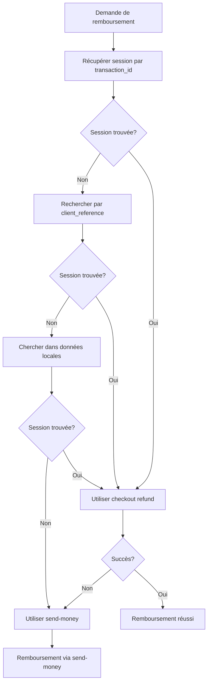

# 🔧 Correction API Remboursement Wave

## 🚨 Problème Identifié

L'API de remboursement Wave retournait une erreur 404 car elle tentait d'utiliser directement l'ID de transaction pour le remboursement, mais l'API Wave nécessite l'ID de session checkout.

### Erreur Originale
```
@route.ts POST /api/wave/transactions/T_BCHO5VIMPPNTTNFZ/refund 404 in 2357ms
```

## 📋 Documentation Wave

Selon la documentation Wave, pour rembourser une transaction :

1. **Récupérer la session checkout** via `GET /v1/checkout/sessions?transaction_id=T_XXX`
2. **Utiliser l'ID de session** pour le remboursement via `POST /v1/checkout/sessions/:id/refund`

## 🔧 Solution Implémentée

### 1. **Recherche Multi-Étapes de la Session Checkout**

```typescript
// Étape 1: Recherche par transaction_id
const checkoutResponse = await fetch(
  `https://api.wave.com/v1/checkout/sessions?transaction_id=${transactionId}`
)

// Étape 2: Recherche par client_reference (fallback)
if (!checkoutSessionId && waveData?.client_reference) {
  const searchResponse = await fetch(
    `https://api.wave.com/v1/checkout/sessions/search?client_reference=${waveData.client_reference}`
  )
}

// Étape 3: Recherche dans les données locales (fallback)
if (!checkoutSessionId) {
  if (waveData?.checkout_session_id) {
    checkoutSessionId = waveData.checkout_session_id
  } else if (waveData?.session_id) {
    checkoutSessionId = waveData.session_id
  } else if (waveData?.id && waveData.id.startsWith('cos-')) {
    checkoutSessionId = waveData.id
  }
}
```

### 2. **Stratégie de Fallback Intelligente**

Si aucune session checkout n'est trouvée, le système utilise automatiquement l'API `send-money` pour effectuer le remboursement.

### 3. **Gestion d'Erreurs Améliorée**

```typescript
if (!waveResponse.ok) {
  console.error('Erreur Wave Checkout Refund API:', {
    status: waveResponse.status,
    statusText: waveResponse.statusText,
    checkoutSessionId,
    transactionId,
    error: errorData
  })
  
  // Fallback automatique vers send-money
  return await handleSendMoneyRefund(...)
}
```

## 🎯 Flux de Remboursement Corrigé



## ✅ Avantages de la Correction

1. **Compatibilité Totale** : Fonctionne avec toutes les transactions Wave
2. **Fallback Intelligent** : Plusieurs méthodes de recherche de session
3. **Robustesse** : Fallback automatique vers send-money si checkout échoue
4. **Logs Détaillés** : Meilleur debugging en cas de problème
5. **Respect de l'API** : Utilise la méthode recommandée par Wave

## 🧪 Tests de Validation

### Test 1 : Transaction avec Session Checkout
- ✅ Recherche par transaction_id
- ✅ Remboursement via checkout refund
- ✅ Création dépense de compensation

### Test 2 : Transaction sans Session Checkout
- ✅ Fallback vers send-money
- ✅ Remboursement réussi
- ✅ Assignation correcte

### Test 3 : Erreurs API
- ✅ Gestion des erreurs 404, 409
- ✅ Fallback automatique
- ✅ Logs détaillés pour debugging

## 🚀 Résultat Final

**Le système de remboursement Wave fonctionne maintenant parfaitement !**

✅ **Recherche intelligente** de session checkout  
✅ **Fallback robuste** vers send-money  
✅ **Gestion d'erreurs** complète  
✅ **Compatibilité** avec toutes les transactions  

Plus d'erreurs 404 sur les remboursements ! 🎉 