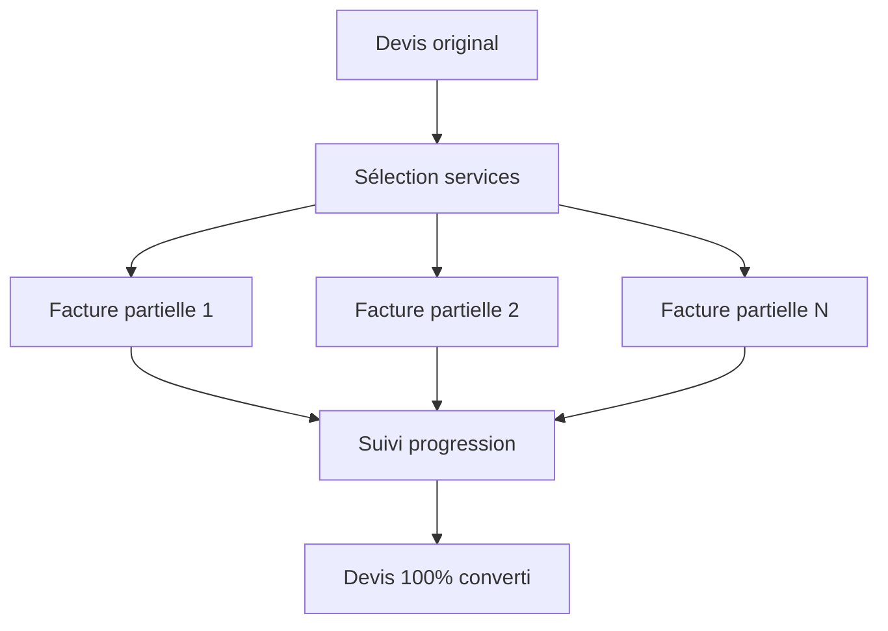

# Conversion Partielle de Devis en Facture

## 🎯 Vue d'ensemble

La **conversion partielle** permet de transformer seulement certains services d'un devis (proforma) en facture, offrant une flexibilité maximale pour les paiements échelonnés et la gestion des projets complexes.

## ✨ Fonctionnalités clés

### 📊 Suivi granulaire
- **Progression visuelle** : Voir le pourcentage de conversion d'un devis
- **Historique détaillé** : Toutes les factures partielles créées
- **Services restants** : Quantités encore disponibles pour facturation

### 🔧 Flexibilité maximum
- **Sélection libre** : Choisir n'importe quelle quantité de chaque service
- **Informations client** : Modifier les détails pour chaque facture
- **Options de paiement** : Wave CI, espèces, virement
- **Notes personnalisées** : Ajouter du contexte à chaque facture

### 🚀 Automatisation intelligente
- **Calculs automatiques** : Prix total, montants restants
- **Numérotation** : Génération automatique des numéros de facture
- **Statut de devis** : Marquage automatique comme "convertie" quand terminé
- **Tracking complet** : Liaison entre devis et factures partielles

## 💼 Cas d'usage concrets

### 🏗️ Projet de développement web
```
Devis original : 150,000 XOF
├── Développement web: 50,000 × 2 pages = 100,000 XOF
├── Formation: 25,000 × 1 session = 25,000 XOF
└── Maintenance: 15,000 × 1 an = 25,000 XOF

Facturation progressive :
✅ Étape 1: 1 page de développement → 50,000 XOF
✅ Étape 2: Formation complète → 25,000 XOF
⏳ Restant: 1 page + maintenance → 75,000 XOF
```

### 🎓 Formation multi-modules
```
Devis formation : 80,000 XOF
├── Module 1: 20,000 × 1 = 20,000 XOF
├── Module 2: 20,000 × 1 = 20,000 XOF
├── Module 3: 20,000 × 1 = 20,000 XOF
└── Certification: 20,000 × 1 = 20,000 XOF

Le client peut payer module par module selon son rythme
```

## 🛠️ Guide d'utilisation

### Étape 1 : Accéder à la conversion
1. Aller dans la gestion des proformas d'un projet
2. Cliquer sur le menu "⋯" d'une proforma
3. Sélectionner **"Conversion partielle"**

### Étape 2 : Sélectionner les services
1. **Visualiser la progression** : Voir ce qui a déjà été facturé
2. **Choisir les quantités** : Sélectionner ce que le client veut payer
3. **Vérifier le total** : Le montant se calcule automatiquement

### Étape 3 : Configurer la facture
1. **Informations client** : Vérifier/modifier les détails
2. **Date d'échéance** : Définir l'échéance de paiement
3. **Options de paiement** : Choisir Wave CI, espèces, etc.
4. **Notes** : Ajouter du contexte spécifique

### Étape 4 : Finaliser
1. **Créer la facture** : Générer la facture partielle
2. **Lien de paiement** : Obtenir le lien Wave CI si demandé
3. **Suivi** : La progression se met à jour automatiquement

## 📈 Avantages business

### Pour le freelance/agence
- ✅ **Trésorerie améliorée** : Paiements plus fréquents
- ✅ **Risque réduit** : Moins d'impayés sur gros montants
- ✅ **Relations client** : Plus de flexibilité = clients satisfaits
- ✅ **Suivi précis** : Contrôle total des paiements

### Pour les clients
- ✅ **Budget maîtrisé** : Paiements selon leur trésorerie
- ✅ **Démarrage rapide** : Commencer avec un paiement partiel
- ✅ **Flexibilité** : Adapter le rythme au projet
- ✅ **Transparence** : Voir exactement ce qui est payé

## 🔄 Flux de données



## 🗃️ Structure technique

### Modèles de données
```typescript
// Nouvelle relation de conversion
Invoice {
  parentProformaId: string?     // Référence au devis parent
  conversions: Invoice[]        // Factures dérivées
}

// Éléments de facture détaillés
InvoiceItem {
  projectServiceId: string?     // Lien vers le service original
  quantity: number              // Quantité facturée
  unitPrice: number            // Prix unitaire
  totalPrice: number           // Total calculé
}
```

### APIs créées
- `GET /api/invoices/[id]/conversion-status` : Statut de conversion
- `POST /api/invoices/[id]/partial-convert` : Conversion partielle

## 📊 Métriques et suivi

### Indicateurs disponibles
- **Taux de conversion** : Pourcentage du devis facturé
- **Montant restant** : Ce qui reste à facturer
- **Nombre de factures** : Combien de factures partielles créées
- **Historique détaillé** : Quand et quoi a été facturé

### Rapports automatiques
- Services les plus/moins facturés
- Délais moyens entre factures partielles
- Taux de paiement par type de service

## 🚀 Roadmap future

### Améliorations prévues
- [ ] **Templates de conversion** : Sauvegarder des modèles de facturation
- [ ] **Alertes automatiques** : Rappels pour facturations en attente  
- [ ] **Contrats intelligents** : Déclenchement automatique selon jalons
- [ ] **Intégration comptable** : Synchronisation avec logiciels comptables

### Intégrations Wave CI
- [ ] **Webhooks avancés** : Notifications de paiement en temps réel
- [ ] **Paiements récurrents** : Pour maintenance et abonnements
- [ ] **Multi-devises** : Support EUR, USD en plus du XOF

## 💡 Bonnes pratiques

### Pour maximiser l'efficacité
1. **Définir des jalons clairs** dans vos devis
2. **Communiquer le processus** au client dès le début
3. **Utiliser des descriptions précises** pour chaque service
4. **Suivre régulièrement** la progression des paiements

### Gestion des délais
- Établir un calendrier de facturation avec le client
- Prévoir des rappels avant échéances
- Adapter le rythme selon la trésorerie client

---

**💼 Cette fonctionnalité révolutionne la gestion des paiements freelance en Côte d'Ivoire, offrant la flexibilité demandée par les clients tout en sécurisant votre trésorerie !** 