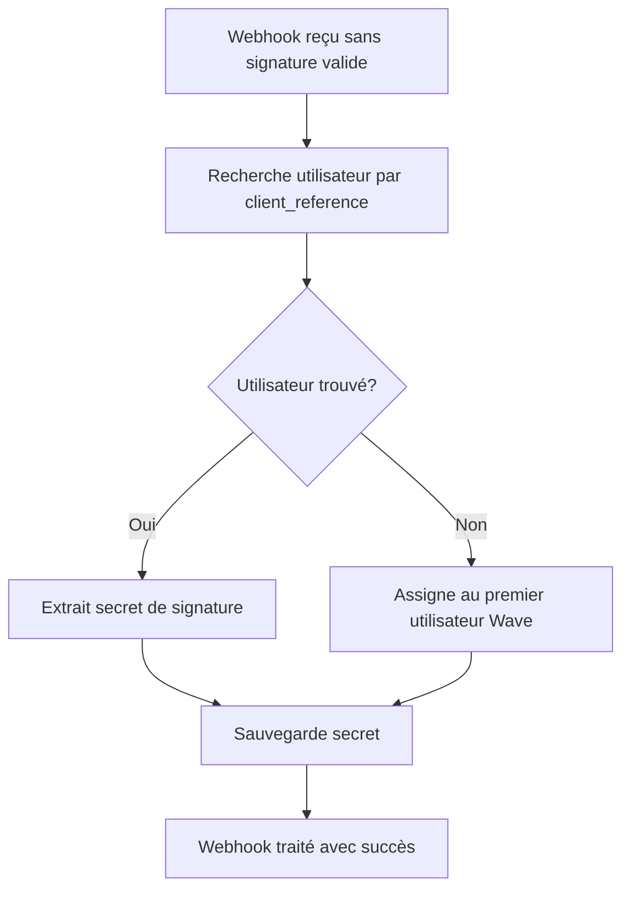

# Configuration Automatique des Webhooks Wave

## Vue d'ensemble

Le système REV dispose maintenant d'un mécanisme de configuration automatique des webhooks Wave qui permet de :
- Tester la connexion webhook automatiquement
- Capturer et configurer automatiquement les secrets de signature
- Associer les webhooks aux bons utilisateurs
- Gérer les signatures Wave de manière sécurisée

## Fonctionnalités

### 1. Bouton "Test Webhook" dans le Profil

**Localisation** : `app/(dashboard)/profile/page.tsx` → Section Wave CI

**Fonctionnalités** :
- Interface utilisateur intuitive avec dialog explicatif
- Test automatique de la configuration webhook
- Configuration automatique du secret de signature
- Feedback visuel en temps réel

**Utilisation** :
1. Aller dans Profil → Section Wave CI
2. Saisir la clé API Wave
3. Cliquer sur "Test Webhook"
4. Le système configure automatiquement le secret

### 2. API de Test Webhook

**Endpoint** : `POST /api/wave/test-webhook`

**Fonctionnalités** :
- Génère un secret temporaire unique
- Crée des notifications de suivi
- Sauvegarde automatique dans le profil utilisateur
- Gestion d'erreurs complète

**Payload** :
```json
{
  "waveApiKey": "wave_api_key_here",
  "merchantName": "Nom du marchand"
}
```

**Réponse de succès** :
```json
{
  "success": true,
  "message": "Secret webhook configuré avec succès",
  "webhookSecret": "wave_test_1234567890_abcd1234",
  "testEventId": "test_user123_1234567890",
  "note": "Un secret temporaire a été généré. Lors du premier vrai paiement, il sera automatiquement mis à jour avec le secret Wave réel."
}
```

### 3. Webhook Intelligent

**Endpoint** : `POST /api/webhooks/wave`

**Nouvelles fonctionnalités** :
- **Détection automatique d'utilisateur** : Si aucune signature valide, détecte l'utilisateur via `client_reference` ou assigne au premier utilisateur Wave
- **Configuration automatique** : Extrait et sauvegarde automatiquement les secrets de signature
- **Gestion des événements de test** : Traite spécialement les événements `test.test_event`
- **Fallback intelligent** : Plusieurs méthodes de validation et d'assignation

## Flux de Configuration

### Méthode 1 : Configuration Manuelle (Recommandée)

```mermaid
graph TD
    A[Utilisateur clique "Test Webhook"] --> B[API génère secret temporaire]
    B --> C[Secret sauvegardé dans profil]
    C --> D[Notification de succès]
    D --> E[Webhook prêt à recevoir paiements]
    E --> F[Premier paiement met à jour avec vrai secret]
```

### Méthode 2 : Configuration Automatique



## Sécurité

### Extraction de Secret

La fonction `extractSecretFromSignature()` crée un secret unique basé sur :
- Hash de la signature Wave (16 premiers caractères)
- Timestamp (8 derniers caractères)
- Préfixe "wave_" pour identification

**Format** : `wave_[hash16]_[timestamp8]`

**Exemple** : `wave_4f8ffb032c60b43d_88399`

### Validation Multi-Niveaux

1. **Signature exacte** : Validation HMAC-SHA256 avec secret utilisateur
2. **Détection par référence** : Recherche via `client_reference` dans les factures
3. **Assignation par défaut** : Premier utilisateur avec clé API Wave configurée

### Mise à Jour Automatique

Lors du premier vrai paiement Wave :
- Le webhook reçoit la vraie signature Wave
- Le système extrait le nouveau secret
- Le profil utilisateur est automatiquement mis à jour
- Les futurs webhooks utilisent le vrai secret

## Interface Utilisateur

### Section Profil Wave CI

**Nouveaux éléments** :
- Bouton "Test Webhook" avec icône Zap
- Dialog explicatif avec étapes détaillées
- Affichage des résultats de test
- Messages d'erreur contextuels

**États visuels** :
- ✅ Succès : Fond vert, icône de validation
- ❌ Erreur : Fond rouge, message d'erreur
- ⏳ En cours : Spinner et texte "Test en cours..."

### Notifications

**Types de notifications créées** :
- `INFO` : Test webhook en cours
- `SUCCESS` : Webhook configuré avec succès
- `WAVE_PAYMENT_RECEIVED` : Paiement reçu et traité

## Debugging et Monitoring

### Logs Importants

```javascript
// Réception webhook
console.log('Webhook Wave reçu')
console.log('Signature Wave:', waveSignature)

// Détection événement test
console.log('Événement de test détecté:', webhook_test_id)

// Configuration automatique
console.log(`Secret automatiquement configuré pour ${user.email}`)

// Assignation utilisateur
console.log(`Utilisateur détecté via client_reference: ${user.email}`)
```

### Points de Contrôle

1. **API Test** : Vérifier la création du secret temporaire
2. **Webhook** : Contrôler la réception et le traitement
3. **Base de données** : Vérifier la sauvegarde du secret
4. **Notifications** : Contrôler la création des notifications

## Dépannage

### Problèmes Courants

**1. Bouton "Test Webhook" grisé**
- **Cause** : Clé API Wave non configurée
- **Solution** : Saisir la clé API Wave dans le champ correspondant

**2. Test échoue avec erreur de connexion**
- **Cause** : Serveur non accessible ou URL incorrecte
- **Solution** : Vérifier la configuration réseau et l'URL webhook

**3. Secret non configuré automatiquement**
- **Cause** : Erreur lors de la sauvegarde en base
- **Solution** : Vérifier les logs serveur et la connexion base de données

**4. Webhooks non reçus**
- **Cause** : URL webhook incorrecte dans Wave
- **Solution** : Copier l'URL exacte depuis l'interface REV

### Commandes de Debug

```bash
# Vérifier les logs webhook
curl -X GET http://localhost:3000/api/webhooks/wave

# Tester l'API de configuration
curl -X POST http://localhost:3000/api/wave/test-webhook \
  -H "Content-Type: application/json" \
  -d '{"waveApiKey":"test","merchantName":"Test"}'
```

## Migration depuis l'Ancien Système

### Utilisateurs Existants

Les utilisateurs ayant déjà configuré manuellement leur secret webhook :
- ✅ Continuent de fonctionner normalement
- ✅ Peuvent utiliser le test pour vérifier leur configuration
- ✅ Le secret existant est préservé sauf s'ils relancent un test

### Nouveaux Utilisateurs

Les nouveaux utilisateurs bénéficient :
- 🚀 Configuration automatique simplifiée
- 🔒 Sécurité renforcée avec secrets uniques
- 📱 Interface utilisateur guidée
- 🔄 Mise à jour automatique des secrets

## Évolutions Futures

### Améliorations Prévues

1. **Test en temps réel** : Envoi d'un vrai webhook de test via l'API Wave
2. **Validation périodique** : Vérification automatique de la validité des secrets
3. **Multi-comptes** : Support de plusieurs comptes Wave par utilisateur
4. **Monitoring avancé** : Dashboard de santé des webhooks

### Intégrations Possibles

- **Slack/Discord** : Notifications de paiements en temps réel
- **Comptabilité** : Synchronisation automatique avec logiciels comptables
- **Analytics** : Tableaux de bord avancés des paiements Wave

## Conclusion

Le nouveau système de configuration automatique des webhooks Wave simplifie considérablement l'intégration Wave CI dans REV tout en maintenant un haut niveau de sécurité. Les utilisateurs peuvent maintenant configurer leurs webhooks en un clic, et le système s'adapte automatiquement aux différents scénarios d'utilisation. 